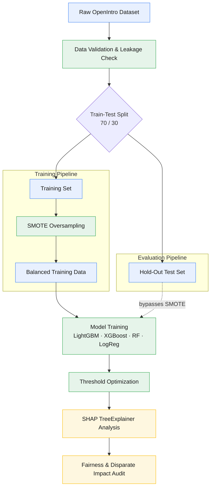

# Credit_Risk_Pipeline_Flowchart

```mermaid
flowchart TD
    A["Raw OpenIntro Dataset"] --> B["Data Validation & Leakage Check"]
    B --> C{"Train-Test Split<br/>70 / 30"}

    subgraph train["Training Pipeline"]
        D["Training Set"] --> F["SMOTE Oversampling"]
        F --> G["Balanced Training Data"]
    end

    subgraph eval["Evaluation Pipeline"]
        E["Hold-Out Test Set"]
    end

    C --> D
    C --> E

    G --> H["Model Training<br/>LightGBM · XGBoost · RF · LogReg"]
    E -. "bypasses SMOTE" .-> H

    H --> I["Threshold Optimization"]
    I --> J["SHAP TreeExplainer Analysis"]
    J --> K["Fairness & Disparate Impact Audit"]

    classDef data fill:#e8f0fe,stroke:#4285f4,color:#1a1a1a
    classDef process fill:#e6f4ea,stroke:#34a853,color:#1a1a1a
    classDef audit fill:#fef7e0,stroke:#fbbc04,color:#1a1a1a

    class A,D,E,G data
    class B,F,H,I process
    class J,K audit
```